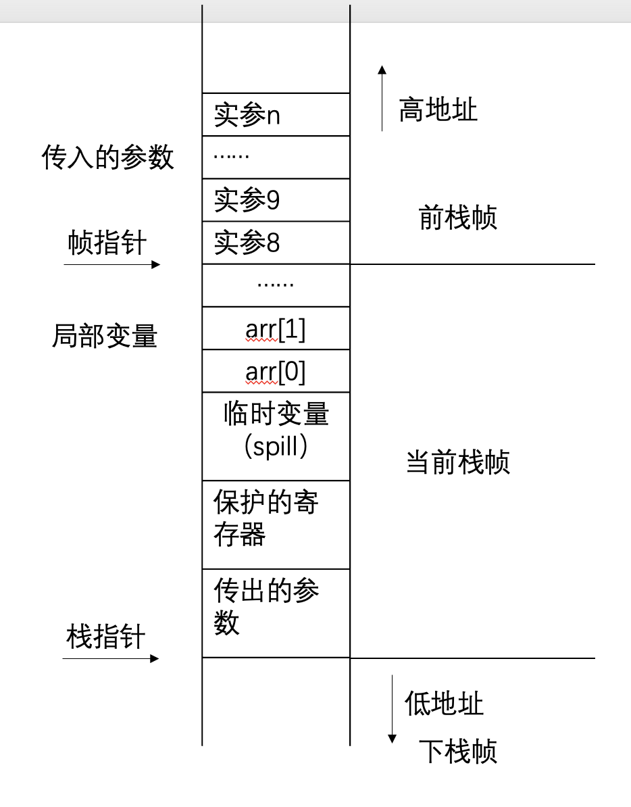

# 编译原理实验 LAB5 实验指南

`LAB5` 为两个主体部分：1️⃣ **指令选择** 和 2️⃣ **寄存器分配**

# 寄存器使用

```c++
#include "register_rules.h"
```

- 全部使用x寄存器，**不区分地址和变量**，**一个int占据8个字节**。
  
- x30、x29，caller-save函数调用前全部保存
  
- 保留16-19用作spill时加载和保存临时变量
  
  >  spill是当物理寄存器不够使用时，将这个虚拟寄存器放在栈中，对应use、def更改为ldr、str。

```c++
#ifndef REGISTER_RULRES
#define REGISTER_RULRES

#include <set>
#include <array>
const std::array<int, 8> paramRegs = {0, 1, 2, 3, 4, 5, 6, 7};
const int XnFP = 29;
const int XXnret = 0;
const int XXnl = 30;
const int INT_LENGTH = 8;


const std::set<int> allocateRegs{9, 10, 11, 12, 13, 14, 15};//caller-save
const int XXn1 = 16;
const int XXn2 = 17;
const int XXn3 = 18;
const int XXn4 = 19;


#endif
```

## 寄存器抽象

```cpp
enum AS_type{
    IMM,//立即数 #10
    SP,//栈指针 sp
    Xn,//x0-x30
    ADR//实现基址寄存器模式、偏移量寻址模式  [x29] [sp,#-30] [x29,x17]
};
struct AS_reg {
    AS_type type;
    union
    {
        int offset;
        struct AS_address *add;
    } u;
};
struct AS_address
{
    AS_reg *base;//<SP|Xn>
    int imm;
    AS_reg *reg;//最多只有一个起作用
};
```


# 指令翻译

```c++
#include "llvm2asm.h"
#include "llvm2asm.cpp"
```

## 可选择指令

```c++
#include "asm_arm.h"
#include "asm_arm.cpp"
```

```c++
enum class AS_stmkind {
    BINOP,//二元运算
    MOV,
    MOVZ;//movz    xn, imm, LSL #16 在这里专门设置大数字的高16位
    MOVK;//movk    xn, imm, LSL #0 在这里专门设置大数字的低16位
    LDR;//一般情况下用于加载内存的变量，特殊情况下从堆栈弹出sp并调整sp
    LDP;//从堆栈中弹出X0和X1： LDP X0, X1， [SP]， #16
    STR;//一般情况下用于存储寄存器，特殊情况下将一个寄存器压入堆栈并调整sp
    STP;//设计用来存储寄存器 将X0和X1压入堆栈： STP X0, X1， [SP， #-16]!
    LABEL,
    B,
    BCOND,
    BL,
    CMP,
    RET,
    ADR,
    LLVMIR//注释，用来debug
};
```

### [寻址模式详解](https://zhuanlan.zhihu.com/p/624008784)

可以查看`printASM.cpp`来理解其效果

```c++
#include "printASM.h"
#include "printASM.cpp"
```

```cpp
struct AS_ldr {
    AS_reg *dst;
    AS_reg *ptr;
    int post_index;//后索引（Post-index）寻址模式：使用后索引寻址，从基指针中的地址加载值，然后更新指针。
};
struct AS_ldp {
    AS_reg *dst1;
    AS_reg *dst2;
    AS_reg *ptr;
    int post_index;//后索引（Post-index）寻址模式：使用后索引寻址，从基指针中的地址加载值，然后更新指针。
};
struct AS_str {
    AS_reg *src;
    AS_reg *ptr;
    int pre_index;//预索引（Pre-index）寻址模式：使用预索引寻址，先更新基指针，之后从更新后的基指针的地址加载值。
};
struct AS_stp {
    AS_reg *src1;
    AS_reg *src2;
    AS_reg *ptr;
    int pre_index;//预索引（Pre-index）寻址模式：使用预索引寻址，先更新基指针，之后从更新后的基指针的地址加载值。
};

```


## 流程：

1. 计算结构体占据空间和每个变量的偏移量

2. 声明函数（ok）

3. 全局变量初始化

4. 函数翻译

   1. 将函数参数加载到虚拟寄存器

      - 当函数参数数`<=8`,直接从`x0-x7`获取
      - 当函数参数`>8`,其余参数使用栈传递

   2. 调整栈指针`sp`

      - 计算局部变量占据的空间
      - 对于每个局部变量，计算相对于当前栈帧帧指针`fp(x29)`的偏移量并保存等待使用

   3. 翻译函数体

      - 使用的都是虚拟寄存器

      - 保持SSA，需要增加寄存器时通过`new AS_reg(AS_type::Xn, Temp_newtemp_int()->num);`获取新的虚拟寄存器。

      - ### getelementptr指令翻译

        - 见下方

      - ### Call|Ret

        - 见下方

      - phi

        - 不和剩余指令一起翻译

      - **Br**

        - 和cmp联合翻译，需要记录br i1 %rn的来源

        - ```assembly
                  //  %r112 = icmp sge i32 %r266, 48
                  mov     x11, #48
                  cmp     x12, x11
                  //  br i1 %r112, label %bb12, label %bb11
                  b.ge     bb12
                  b     bb11
          ```

   4. **phi指令翻译**

      位置、方法可选

      - 将phi改成move指令，插在前驱block的最后

        >  思考：为什么将phi改成move指令，插在前驱block的最后多次def了，但是不会改变活跃分析的结果？

      - dessa:转换成str和ldr

   

   

### 函数调用约定

1. 函数调用

   1. 保存现场：caller-save寄存器入栈。
   2. 当前帧指针和`x30`入栈。
   3. 多余的实参入栈
   4. 设置帧指针
   5. bl 到相关函数
   6. 加载帧指针和`x30`。
   7. 恢复现场
   8. 从X0获取返回值进入虚拟寄存器
2. 函数被调用
   1. 保存函数参数到虚拟寄存器
   2. 调整栈指针`sp`
   3. 返回
      1. 返回值**移入物理寄存器`x0`**（如果有）
      2. 根据**帧指针调整栈指针到函数调用前的状态，`mov sp, x29`**
      3. `ret`


#### 示例

```assembly
        //  %r257 = call i32 @getch()

        stp     x9, x10, [sp, #-16]!
        stp     x11, x12, [sp, #-16]!
        stp     x13, x14, [sp, #-16]!
        str     x15, [sp, #-8]!
        stp     x29, x30, [sp, #-16]!
        mov     x29, sp
        bl     getch
        ldp     x29, x30, [sp], #16
        ldr     x15, [sp], #8
        ldp     x13, x14, [sp], #16
        ldp     x11, x12, [sp], #16
        ldp     x9, x10, [sp], #16
        mov     x11, x0
```


### getelementptr指令翻译

aarch64的数据都是无类型的，getelementptr只是寄存器的加减乘除。

- 局部变量
  - 根据`fpOffset`首先计算出首地址`base_ptr`，之后根据类型计算偏移，得到`new_ptr`
- ### 全局变量
  
  - 使用`adr`获得首地址`base_ptr`，之后根据类型计算偏移，得到`new_ptr`
- 函数参数|中间变量
  - 直接当做`base_ptr`使用，不需要额外计算，之后根据类型计算偏移，得到`new_ptr`

在计算的过程中注意保持SSA形式，需要增加虚拟寄存器，虚拟寄存器编号通过`Temp_newtemp_int()->num`获得。

#### 示例

```assembly
				//%r271->x10
				//%r134->x11
				//%r135->x11
//  %r134 = getelementptr [1005 x i32 ], [1005 x i32 ]* @head, i32 0, i32 %r271

        mov     x11, #8
        mul     x12, x10, x11
        adrp     x11, head
        add     x11, x11, #:lo12:head
        add     x11, x11, x12
        //  %r135 = load i32, i32* %r134

        ldr     x11, [x11]
```


### BCOND

ARMv8架构中的BCOND指令是一条条件分支指令，用于根据特定条件跳转到目标地址。这在控制程序的执行流时尤其有用，比如在实现循环、条件判断等结构时。

#### 条件分支

BCOND指令会根据指定的条件进行跳转。ARMv8架构提供了一组条件码，可以用来决定分支是否执行。常见的条件码包括：

```cpp
enum class AS_relopkind {
    EQ_,
    NE_,
    LT_,
    GT_,
    LE_,
    GE_,
};
```

# 寄存器分配

```cpp
#include "allocReg.h"
#include "allocReg.cpp"
```

预分配的物理寄存器

- 编号`<100`
- 如x0-x7,x29,x30

待分配的虚拟寄存器

- 编号`>=100`

## 流程：

1. 计算实现构建干扰图（ok）

2. **删除没有使用过的变量(ok)**

   >   如果一个变量只定义没有use，那么它就可以任意染色，因此可能ntr别人的寄存器

3. 寄存器分配

   1. 线性扫描算法
   2. 图染色算法
   3. 基于单纯消除序列的方法

4. 有位置的寄存器color

5. **spill** 没有位置的寄存器要修改代码。 

   - **再次调整栈指针**。

   - 记录临时变量相对于`sp`的偏移量

   - **对use变量a地方，每次从栈中ldr， def变量a的地方，str到栈中** 

   - 需要额外计算，使用保留的物理寄存器

### 图染色算法

图着色问题，颜色对应与寄存器。我们有K个寄存器。

1. 活跃分析（已实现）

2. **build**（已实现）

   构造冲突图`Graph<RegInfo> interferenceGraph;`，如果两个变量不能分配到同一个寄存器中，则称它们是**冲突的**

3. **simplify**

   **反复**从图中删除度数<K的节点，放入栈中，直到没有度数<K的节点。进入spill。

   >  simplify时，**减少对应节点的度数即可**，所有前驱和后继关系在原图中不会更改。

4. **potential spill**

   将**一个**度数>=K的节点从图中删除，并标记为溢出。继续simplify。

5. **select**

   从栈中不断恢复节点。筛选邻居节点中已经染色的节点，尝试使用剩余的颜色染色。

6. **actual spill**

# 示例

- https://godbolt.org/一个交互式在线编译器，可以展示编译后的汇编输出，支持多种语言，包括C++、Rust、Go等。
- /example下有BFS的完整实例。

# 调试

使用 `qemu-aarch64` 配合 `gdb` 来调试 64 位 ARM（AArch64）二进制文件。以下是具体步骤：

### 1. 安装必要的工具 

确保你已经安装了 `qemu-aarch64` 和 `gdb-multiarch` 或 `gdb`（支持 AArch64 的 GDB）。

 在 Debian/Ubuntu 系统上，可以使用以下命令： 

```sh sudo apt-get update sudo apt-get install qemu-user-static gdb-multiarch ``` 

### 2. 启动 QEMU 并启用 GDB 调试 

使用 `qemu-aarch64` 启动你的程序，并启用 GDB 调试模式。

指定 QEMU 在某个端口上等待 GDB 连接。

 ```sh qemu-aarch64 -g 1234 ./int_split ``` 这里，`-g 1234` 表示 QEMU 将在端口 `1234` 上等待 GDB 的连接。 

### 3. 启动 GDB 并连接到 QEMU 在另一个终端中

启动 `gdb-multiarch` 或 `gdb`： ```sh gdb-multiarch ./int_split ``` 

然后，在 GDB 提示符下连接到 QEMU：

```bash
target remote localhost:1234
```

### 其他常用 GDB 命令 

**设置断点**：

 ```(gdb) break main ``` 

 ```(gdb)  break bb1 ``` 

  ```(gdb)  break *0x500067bc ```  

**查看寄存器值**：  

 ```(gdb) info registers  ```    

```(gdb) print $pc  ``` 

 ```(gdb) print $x10  ``` 

 ```(gdb) p/o $x10  ``` 

/x /d /o /t

**查看内存内容**：  

 ```(gdb) x/10i $pc  // 查看当前 $pc（程序计数器）处的 10 条指令  ```

 ```(gdb) x/20x $sp  // 查看当前 $sp（栈指针）处的 20 个字节的内容  ``` - 

**单步执行指令**：   

```gdb  (gdb) stepi  ``` 

```    (gdb) step 10//执行10步源代码语句，并进入函数内部```

 ```(gdb) next 10//执行10步源代码语句，而不进入函数内部```

 **继续执行**：

 ```gdb  (gdb) continue  ``` 

**跳出当前函数**：

   ```gdb  (gdb) finish ``` 

**查看当前栈帧:**

``(gdb) backtrace``
